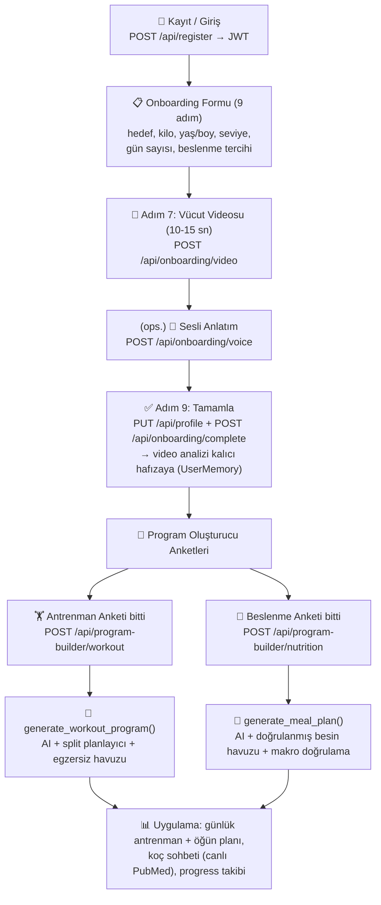
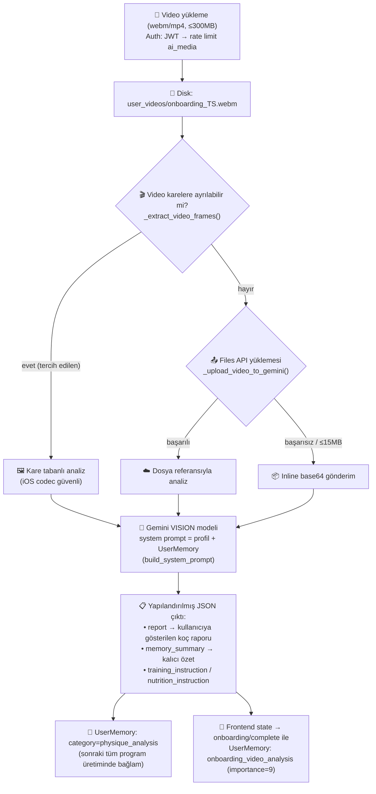
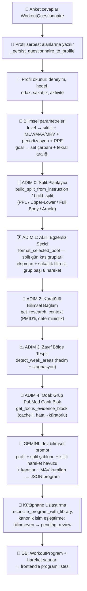
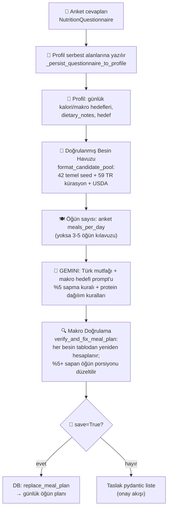
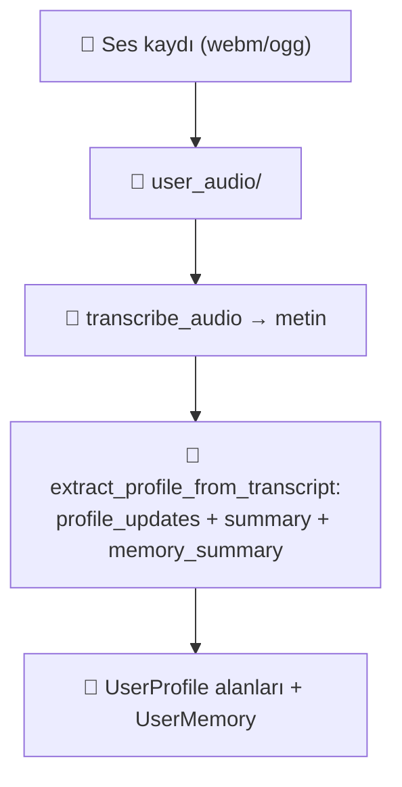

# Yeni Kullanıcı Akış Diyagramları (Arkplan Gerçek Kod Karşılıkları)

Bu dosyadaki diyagramlar **Mermaid** formatındadır; GitHub, VS Code (Mermaid eklentisi),
Notion ve mermaid.live adresinde doğrudan render edilir. Diyagramlardaki her adım
koddaki gerçek fonksiyon/endpoint karşılığıyla etiketlenmiştir.

---

## 1. Genel Yolculuk: Kayıttan Programlara

---

## 2. Video Analizi Arkaplanı (Ne Oluyor?)

---

## 3. Antrenman Programı Üretimi (AI Öncesi Hazırlık + AI + Sonrası)

---

## 4. Beslenme Planı Üretimi

---

## 5. Sesli Anlatım (opsiyonel kol)

